# High-Velocity Impact on a Composite Enclosure — Energy Attenuator Design (Explicit FEA)

[](LICENSE)


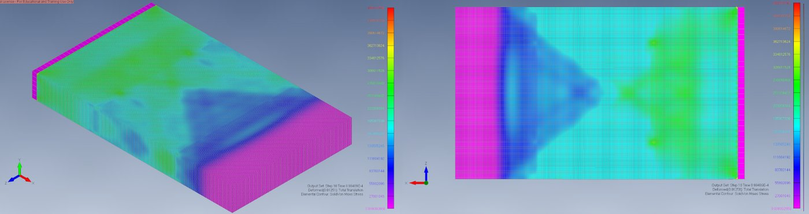
*Unprotected AS4/PEEK enclosure, front impact at 13.86 m/s: von Mises stress at peak deformation.*

---

## Project Overview

This project uses **explicit finite element analysis** to simulate a **1,300 kg mass striking a carbon-fibre AS4/PEEK enclosure at 13.86 m/s** (≈ 125 kJ of kinetic energy, the kind of load seen in an accidental vehicle collision). It then designs and compares **six composite energy attenuators** mounted on the front face.

The study answers three questions:

1. **Baseline:** How far does the bare enclosure deform, and where is stress highest, in front and side impacts?
2. **Attenuator evaluation:** How much do six layups (Kevlar-29/epoxy, P707AG-15 carbon, T650/epoxy carbon; two stacking sequences each), packaged in a **100 mm envelope**, reduce enclosure deformation?
3. **Selection:** Which layup gives the best balance between lower deformation and added mass, against a **5 mm deformation target**?

> **MSc Motorsport Engineering coursework (Impact Modelling), Oxford Brookes University, 2025.** Workflow covered: geometry, meshing, material cards, contact set-up, an element formulation study, explicit solving, post-processing and technical reporting.

---

## Key Results

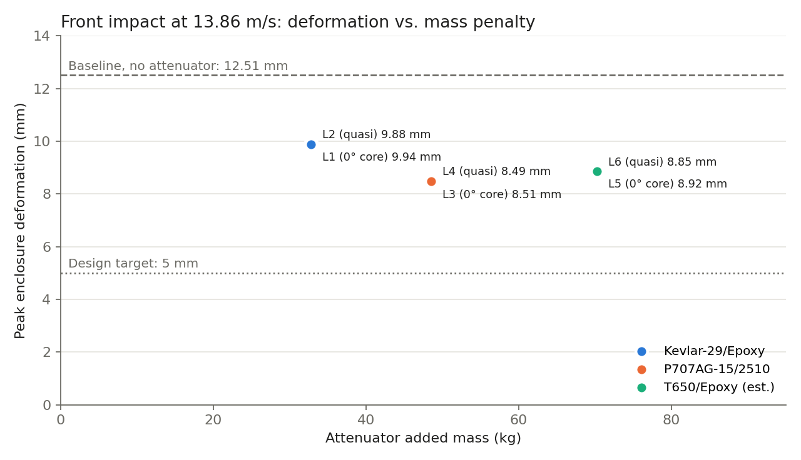

| Case | Material system | Layup | Added mass (kg) | Peak enclosure deformation (mm) | Max von Mises (MPa) |
|---|---|---|---|---|---|
| Baseline | AS4/PEEK, no attenuator | — | 0 | **12.51** | 446 |
| L1 | Kevlar-29/Epoxy | [45/−45/0/0/0/0/0/0/−45/45] | 32.8 | 9.94 | 352 |
| **L2 (selected)** | **Kevlar-29/Epoxy** | **[45/−45/0/0/45/−45/0/0/−45/45]** | **32.8** | **9.88** | **353** |
| L3 | P707AG-15/2510 | [45/−45/0/0/0/0/0/0/−45/0] | 48.54 | 8.51 | 383 |
| L4 | P707AG-15/2510 | [45/−45/0/0/45/−45/0/0/−45/0] | 48.54 | 8.49 | 377 |
| L5 | T650/Epoxy (est.) | [45/−45/0/0/0/0/0/0/−45/45] | 70.21 | 8.92 | 215 |
| L6 | T650/Epoxy (est.) | [45/−45/0/0/45/−45/0/0/−45/45] | 70.21 | 8.85 | 194 |

- ✅ Every attenuator reduced front-impact deformation, by **21% to 32%** compared with the baseline.
- ✅ **L2 (Kevlar-29/epoxy, quasi-isotropic core)** was selected as the lightest effective option: **−21% deformation for 32.8 kg**. L4 (P707AG-15) gave the lowest deformation (−32%) but added 15.7 kg more.
- ✅ T650/epoxy attenuators cut peak enclosure stress by up to **56%** (446 → 194 MPa), but they were the heaviest (70 kg).
- ⚠️ **No layup reached the 5 mm target** within the 100 mm envelope. This is an honest result, and it defines the next design step (see [Future Work](#future-work)).
- Side impact on the bare enclosure: **13.85 mm, 358 MPa**. This is slightly worse than the front impact, so the side walls need protection as well.

---

## Methodology

### Geometry

A 2,100 × 1,260 × 250 mm enclosure with 10 mm walls and internal stiffening ribs. The attenuator fits a 100 mm envelope on the front face.

| Enclosure geometry | Attenuator ply stacks |
|:---:|:---:|
| 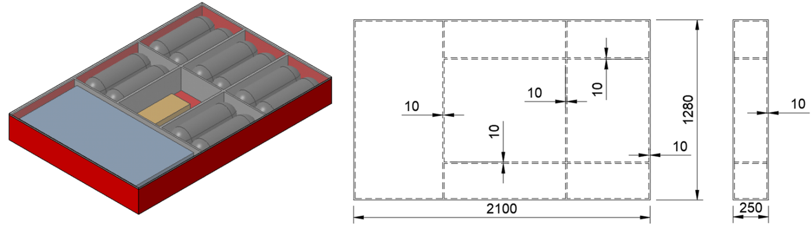 | 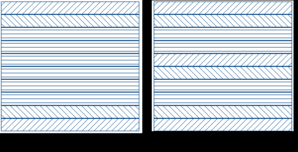 |

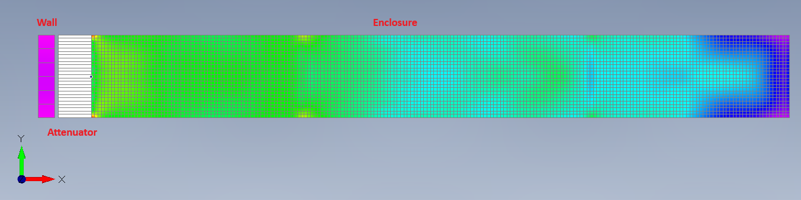
*Simulation set-up: rigid wall + attenuator + enclosure.*

### Solver set-up

| Item | Choice | Why |
|---|---|---|
| Solver | LS-DYNA explicit (4 SMP threads), set up in Simcenter Femap | Short-duration, highly non-linear contact and damage event |
| Composite material | `MAT_054` Enhanced Composite Damage | Orthotropic elastic with **Chang–Chang** failure: fibre and matrix, tension and compression modes kept separate |
| Enclosure elements | 8-node hexahedral solids, fully integrated (6-DOF/node) | Captures the 3-D stress state that drives delamination near the impact zone |
| Attenuator elements | Belytschko–Tsay shells with a layered layup definition | Ply-by-ply stacking with progressive damage |
| Impactor | Rigid wall (concrete, `MAT_RIGID`), fixed | Represents a non-deforming barrier |
| Loading | Initial velocity of 13.86 m/s on the enclosure, normal to the target face | Velocity is only an initial condition, so the motion after contact comes from the physics |
| Contact | Automatic surface-to-surface, μs = 0.3, μd = 0.25 | Robust contact for large deformation |
| Attenuator–enclosure interface | Tied contact | Simple; assumes perfect bonding (upper bound) |
| Mesh | Structured hex mesh, 10 mm in thin internal walls, coarser in thick sections | Balances accuracy against explicit time-step cost |
| Gravity | Neglected | Negligible next to the impact inertia |

### Material properties (input to `MAT_054`)

| Material | ρ (kg/m³) | E₁₁ (GPa) | E₂₂ (GPa) | G₁₂ (GPa) | Xt (MPa) | Xc (MPa) | Yt (MPa) | Yc (MPa) | S (MPa) |
|---|---|---|---|---|---|---|---|---|---|
| AS4/PEEK (enclosure) | 1400 | 134 | 8.9 | 5.14 | 1330 | 1070 | 40.5 | 294 | 200 |
| Kevlar-29/Epoxy | 1025 | 100.06 | 10.06 | 0.77 | 510 | 500 | 38.7 | 250 | 177 |
| P707AG-15 | 1517 | 128 | 9.03 | 5.22 | 1682 | 1400 | 52.9 | 283 | 159 |
| T650/Epoxy (est.) | 2194 | 139 | 10 | 1.44 | 1100 | 206 | 21.2 | 200 | 160 |

The full orthotropic set (E₃₃, ν, G₂₃, G₃₁, TFAIL) is in the [report](docs/Impact_Modelling_Report.pdf).

### Solid element formulation study (side impact)

Before running the full matrix of cases, I compared three LS-DYNA solid element formulations on the side-impact case to check how sensitive the results are to the element choice and what each one costs to run:

| Formulation (`ELFORM`) | Peak deformation (mm) | Max von Mises (MPa) | CPU time (s) |
|---|---|---|---|
| Constant stress, 1-point (1) | 13.40 | 336.6 | 11 |
| Fully integrated S/R (2) | 14.12 | 325.1 | 37 |
| **Fully integrated 6-DOF/node (3)** | **13.85** | **358.1** | **126** |

Peak deformation stays within about 3% across the three formulations. The 1-point element is 11× faster but has no protection against hourglass modes and underpredicts peak stress. The fully integrated 6-DOF element was used for all production runs.

| ELFORM 1 | ELFORM 2 | ELFORM 3 |
|:---:|:---:|:---:|
| 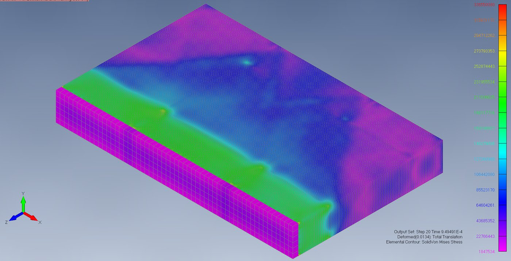 | 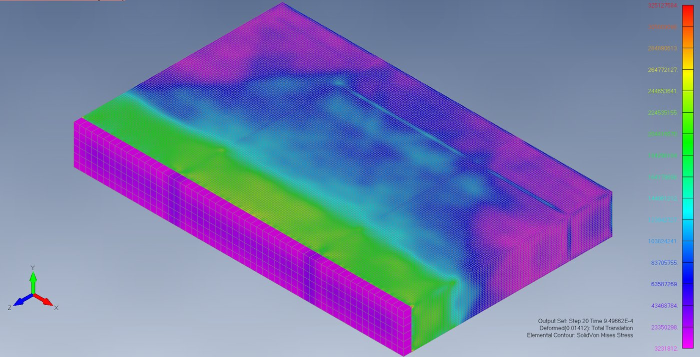 | 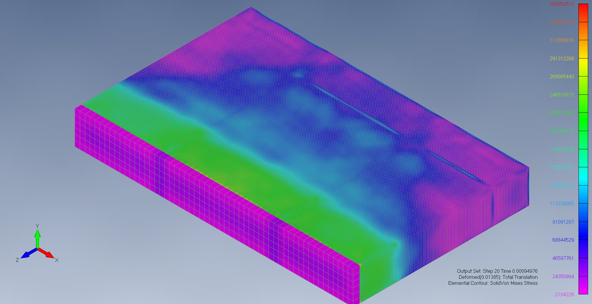 |

---

## Results Gallery

### Baseline (no attenuator)

| Front impact: 12.51 mm, 446 MPa | Side impact: 13.85 mm, 358 MPa |
|:---:|:---:|
|  | 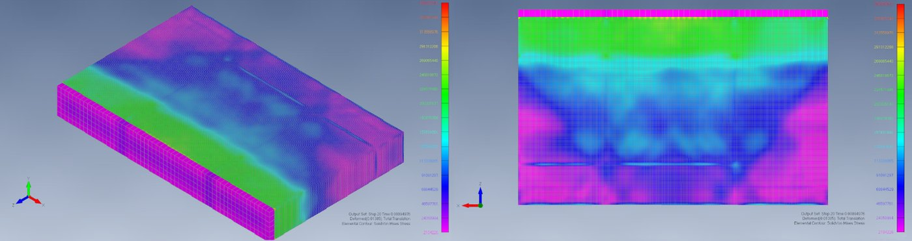 |

In the front impact, stress spreads across the whole impacted face, and the contour pattern shows likely fibre damage starting near the centre and the edges. In the side impact, stress concentrates along the struck wall and the internal ribs.

### Front impact with attenuators

| L1 Kevlar, 0° core | L2 Kevlar, quasi (selected) |
|:---:|:---:|
| 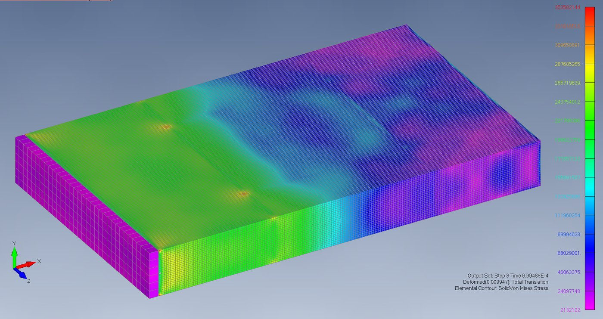 | 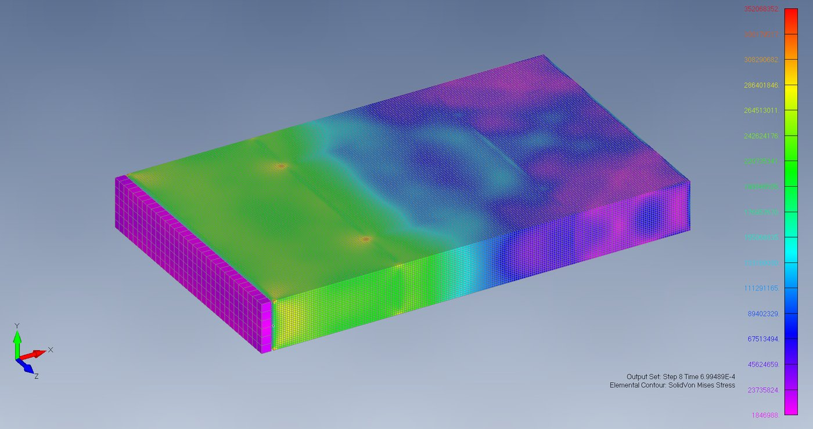 |
| **L3 P707AG-15, 0° core** | **L4 P707AG-15, quasi** |
| 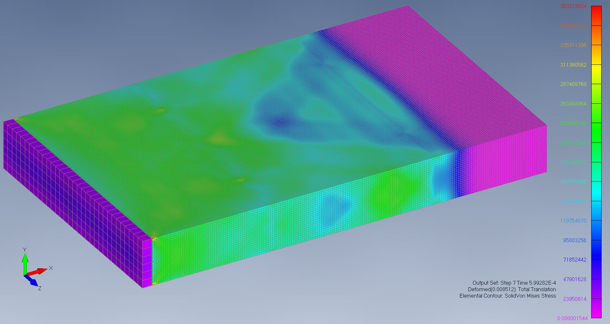 | 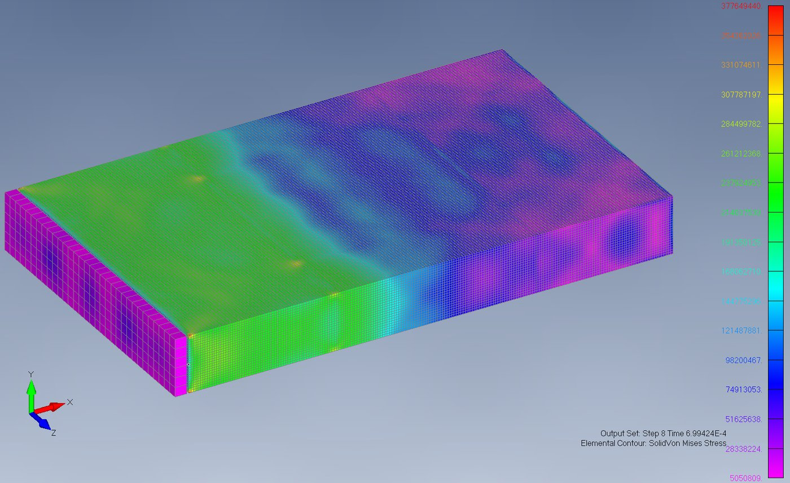 |
| **L5 T650, 0° core** (max shear contour) | **L6 T650, quasi** (max shear contour) |
| 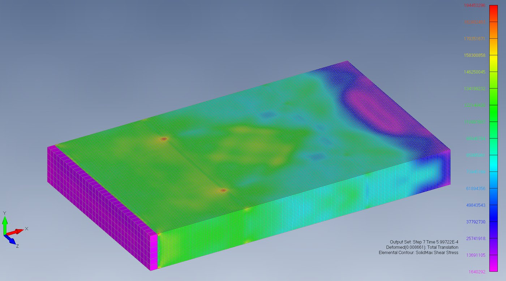 | 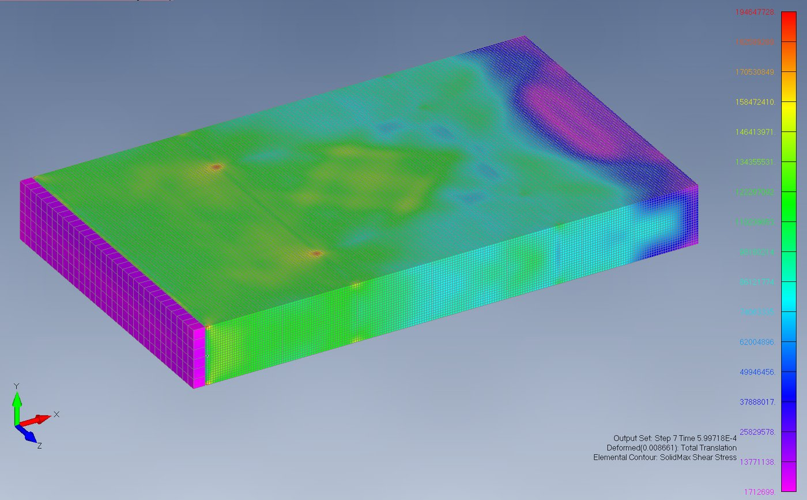 |

---

## Discussion

- **Stiffness vs. mass:** The carbon systems (P707AG-15, T650) are stiffer, so they resist the impact more strongly at first and give lower enclosure deformation than Kevlar with the same ply count. The price is density: T650 adds more than twice the mass of Kevlar for only about 1 mm less deformation.
- **Ply architecture:** Swapping the 0° core for ±45° plies changed deformation by less than 1% in every material. **The choice of material mattered far more than the stacking sequence.**
- **Failure modes observed:** Compressive crushing, delamination triggered by buckling, and localised fibre fracture in the attenuator. This is the expected progressive crushing behaviour of composite absorbers (Feraboli et al., 2010).

### Error sources & limitations

1. **Material data:** Nominal properties with no strain-rate or temperature dependence. `MAT_162` (Composite MSC) would add rate effects (Scazzosi et al., 2020).
2. **Failure model:** Chang–Chang predicts when damage starts; the damage progression after that, and so the absorbed energy, is less certain. Puck may handle matrix compression better.
3. **Contact:** Penalty contact allows small penetrations, and the friction coefficients are assumed values.
4. **Interface:** The tied attenuator bond cannot debond, so it represents an upper bound on interface strength.
5. **Mesh:** No full convergence study below 10 mm because of computational cost. Sensitivity was instead checked through the element formulation study.

---

## Future Work

- **Reach the 5 mm target:** Use a crush-tube or honeycomb-sandwich attenuator with a **crush initiator (trigger)**, instead of a flat laminate, to get a stable progressive crush and a higher specific energy absorption. Following the **building-block approach** of Feraboli et al. (2010), calibrate at coupon and element level before the full component.
- **Interface and delamination:** Model the interface with cohesive elements or tie-break contact, both between the attenuator and the enclosure and between plies.
- **Higher-fidelity material:** Use `MAT_162` with strain-rate effects, and add energy-balance outputs (internal energy, hourglass and sliding energy) to quantify how much energy each attenuator absorbs.
- **Experimental validation:** Run a drop-tower or sled test with force and acceleration measurement, high-speed video and a post-test damage survey.

---

## Repository Structure

```
├── README.md
├── docs/
│   └── Impact_Modelling_Report.pdf        # Full technical report
├── data/
│   ├── results.csv                        # Baseline + six attenuator cases
│   └── side_element_formulation_study.csv # ELFORM 1 / 2 / 3 comparison
├── figures/                               # Geometry, set-up and contour plots
└── scripts/
    └── plot_results.py                    # Regenerates the results chart
```

```bash
pip install pandas matplotlib
python scripts/plot_results.py
```

---

## Tools

**LS-DYNA** (explicit) · **Simcenter Femap** (pre/post-processing) · **Python** (pandas, matplotlib)

## References

- Chang, F.-K. & Chang, K.-Y. (1987). A progressive damage model for laminated composites containing stress concentrations. *Journal of Composite Materials*, 21(9), 834–855.
- Feraboli, P., Deleo, F., Wade, B., Rassaian, M., Higgins, M., Byar, A., Reggiani, M., Bonfatti, A., DeOto, L. & Masini, A. (2010). Predictive modeling of an energy-absorbing sandwich structural concept using the building block approach. *Composites Part A*, 41(6), 774–786. [doi:10.1016/j.compositesa.2010.02.012](https://doi.org/10.1016/j.compositesa.2010.02.012)
- Scazzosi, R., Manes, A. & Giglio, M. (2020). An enhanced material model for the simulation of high-velocity impact on fiber-reinforced composites. *Procedia Structural Integrity*, 24, 53–65. [doi:10.1016/j.prostr.2020.02.005](https://doi.org/10.1016/j.prostr.2020.02.005)
- LSTC / Ansys. *LS-DYNA Keyword User's Manual, Vol. II: Material Models* (`MAT_054`, `MAT_162`).

---

**Wolfgang Guio** · MSc Motorsport Engineering (Distinction), Oxford Brookes University · [GitHub](https://github.com/wguio07)
